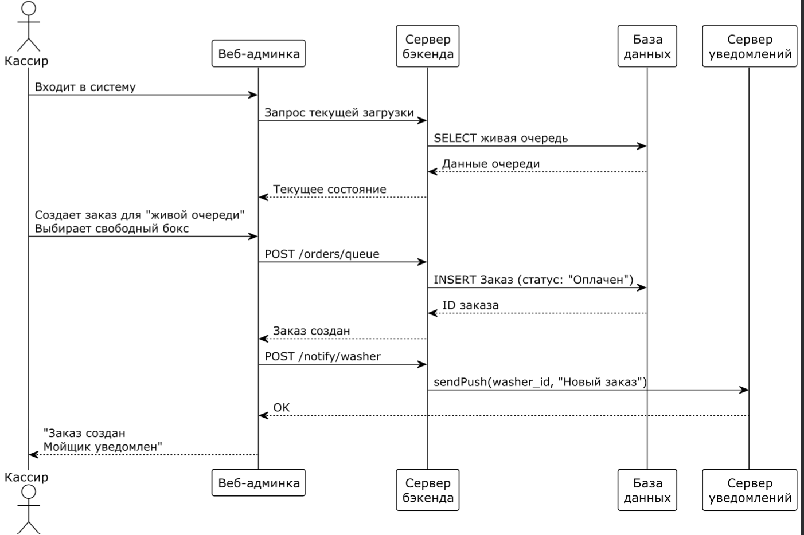
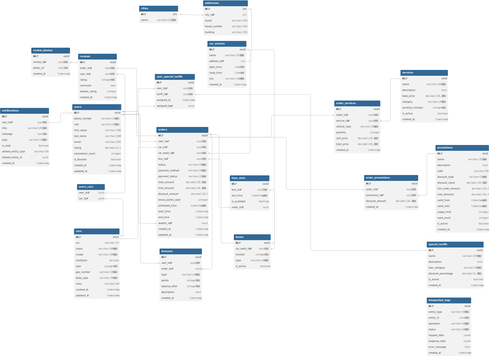
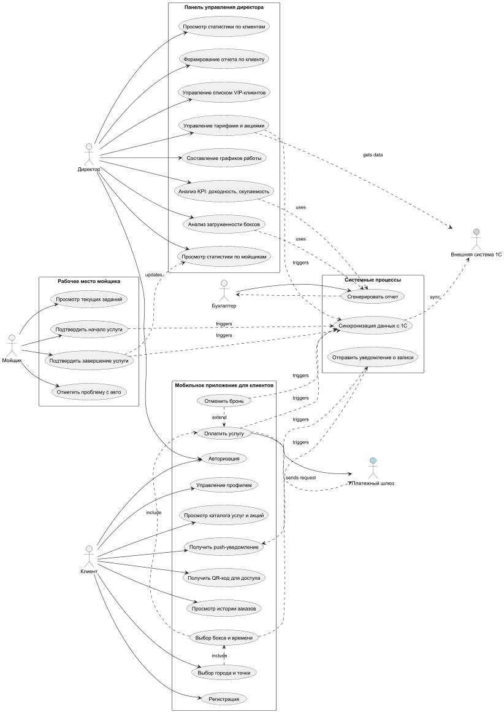
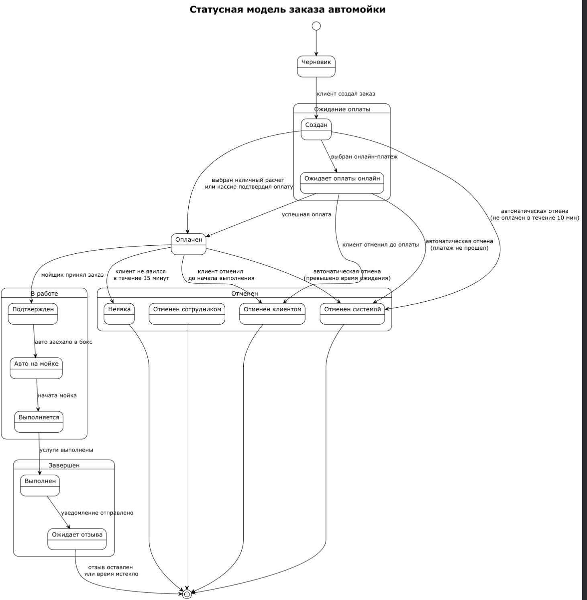

# autoH2O

**Учебный проект по курсу "Интеграция информационных систем"**

---

## Оглавление

- [Описание проекта](#описание-проекта)
- [Структура проекта](#структура-проекта)
- [Документация](./docs)

## Описание проекта

Проект представляет собой систему управления сетью автомоек, включающую функционал для клиентов, сотрудников и администраторов. Система обеспечивает полный цикл обслуживания — от выбора услуги до оплаты и анализа статистики.

## Структура проекта

### Документация и диаграммы

| № | Компонент | Файлы |
|---|-----------|-------|
| **I** | **Требования** | [`Требования.md`](./docs/ts.md) |
| **II** | **Диаграмма последовательности** | [Диаграмма](./docs/sequenceDiagrams/LifeQueue.png)  |
| **III** | **ERD диаграмма** |  |
| **IV** | **UseCase диаграмма** |  |
| **V** | **User Story** | [`User_story.md`](./docs/userStory.md) |
| **VI** | **User Story Mapping** | [`UserStory Mapping`](./docs/UserStoryMapping/User%20Story%20Mapping%202025-11-05-09-05.svg) |
| **VII** | **Status Model** |  |
| **VIII** | **OpenAPI спецификация** | [`Open API`](https://redocly.github.io/redoc/?url=https://raw.githubusercontent.com/WilhelmGans/autoH2O/main/docs/api-docs.json) |
